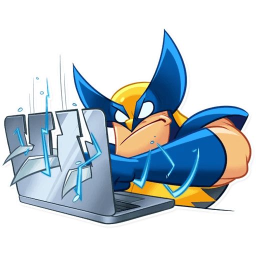
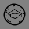

<table><tr><td width=15%></td><td><h1>Let's Fix The Dents In the World,With Programming🐱‍🏍</h1></td></tr></table>
<table >
  <tr>
    <th align=left>
<ul> 
<li> 🔭 I’m currently working on WEB5 Projects.</li>
<li> 🌱 I’m currently learning AI&ML.</li>
<li> 👯 I’m looking to collaborate on MERN based product.</li>
<li> 💬 Ask me about M.E.R.N, EJS , GODOT, A-Frame </li>
<li> 📫 How to reach me: gururajsaraph11@gmail.com</li>
<li> 😄 Pronouns: He.</li>
<li> ⚡ Fun fact:"Programming isn't hard all it takes is efforts and time".</li>
</ul>
</th>
<th>

   </th> 
</tr>
</table>

<!--Technologies and skills-->
<table>
  <tr>
<th></th>
<th width=650px><h2>Technologies I Know</h2></th></tr>
</table>
<table>
  <tr>
  <th></th>
  <th></th>
  <th></th>
  <th></th>
  <th></th>
  <th></th>
  <th></th>
  </tr>
  <tr>
    <th></th>
    <th></th>
    <th>
    <th>
  </tr>
</table>

<h2> ____My Qualifications</h2>
<ul>
  <li></li>
</ul>

<h1>Have a Doudt?Contact me here:</h1>

  <a href="https://facebook.com/gururaj.saraph.7/"><strong>Facebook</strong></a>
   <a href="https://instagram.com/gega_bytes/"><strong>Instagram</strong></a>
 <a href="https://linkedin.com/in/gururaj-saraph"><strong>Linked-in</strong></a>

