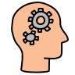

<h1> _________Let's Fix The Dents In the World, ____________________With Programming🐱‍🏍</h1>
<ul>
  <h2>Know me</h2>
<li> 🔭 I’m currently working on WEB5 Projects.</li>
<li> 🌱 I’m currently learning AI&ML.</li>
<li> 👯 I’m looking to collaborate on MERN based product.</li>
<li> 💬 Ask me about M.E.R.N, EJS , GODOT, A-Frame </li>
<li> 📫 How to reach me: gururajsaraph11@gmail.com</li>
<li> 😄 Pronouns: He.</li>
<li> ⚡ Fun fact:"Programming isn't hard all it takes is efforts and time".</li>
</ul>

<h2>_____Technologies I Know</h2>
<table>
  <tr>
  <th></th>
  </tr>
</table>

<h2> ____My Qualifications</h2>
<ul>
  <li></li>
</ul>
